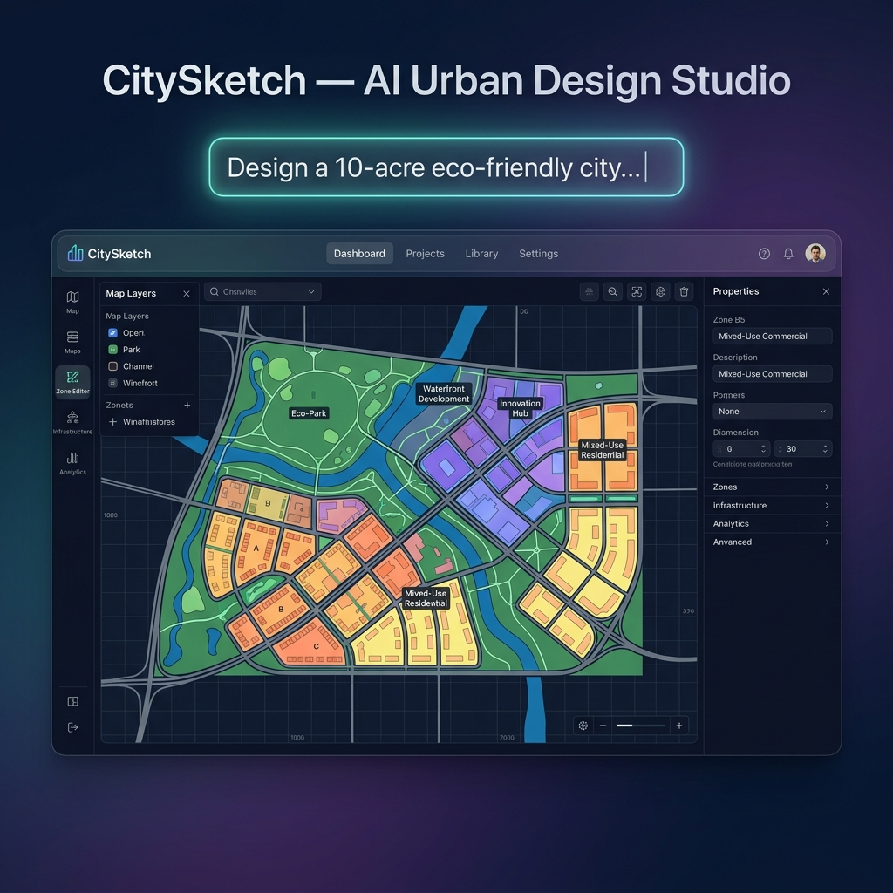
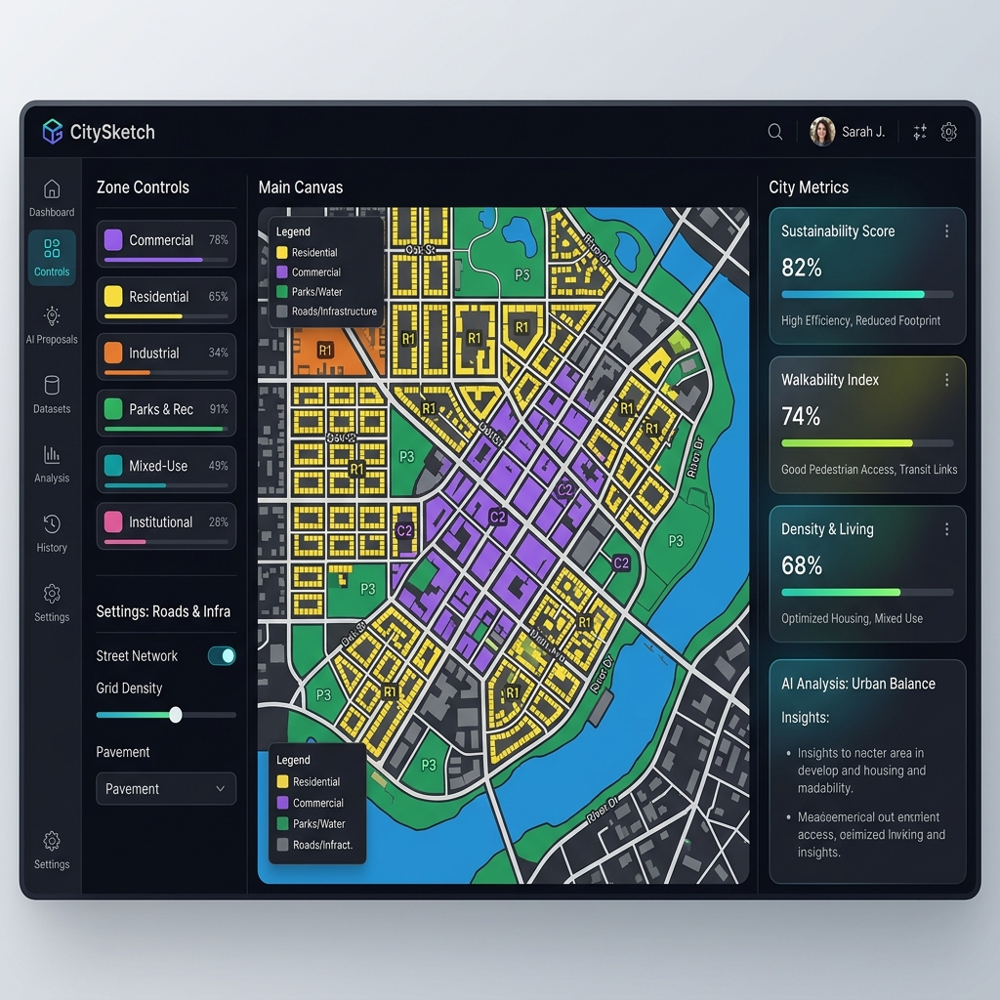
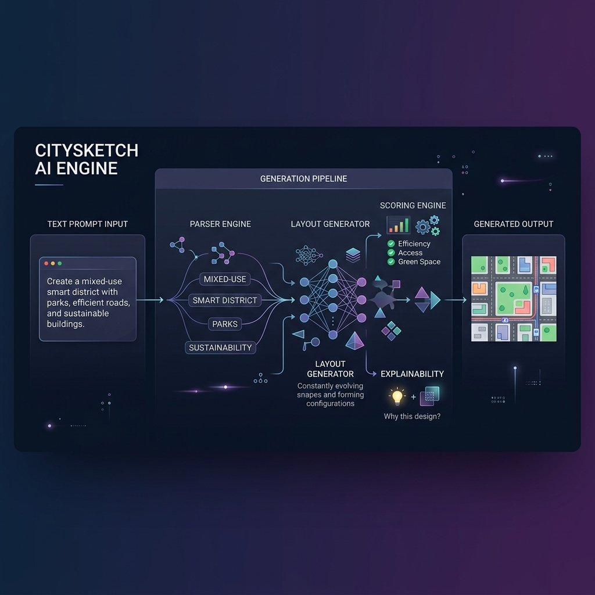
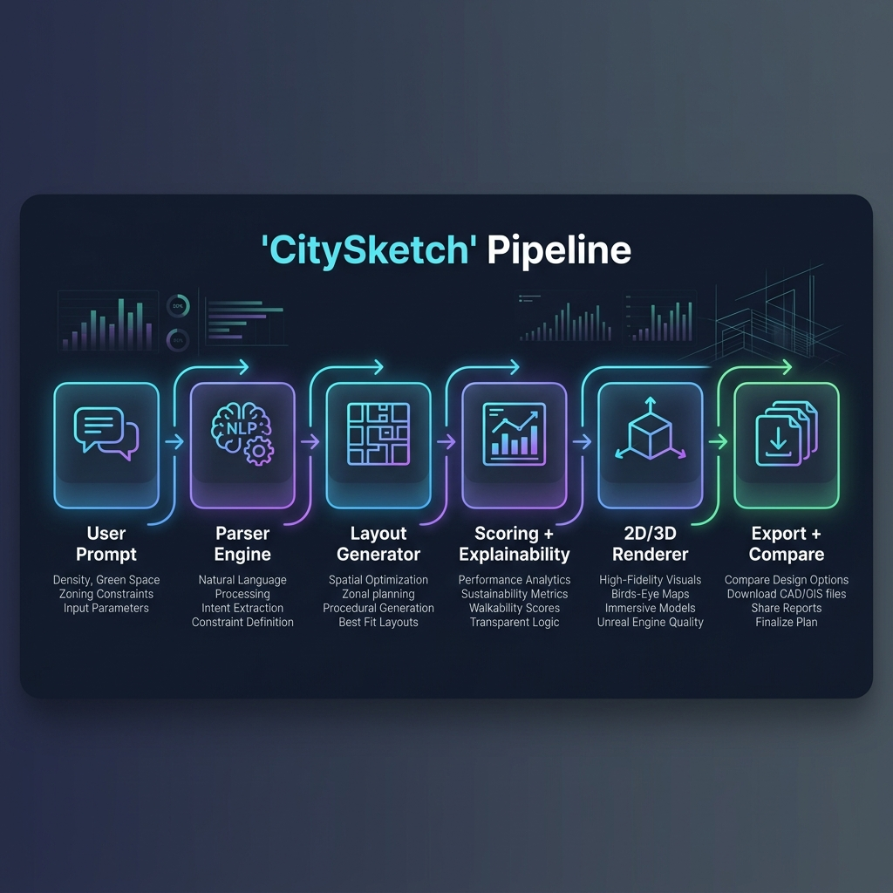
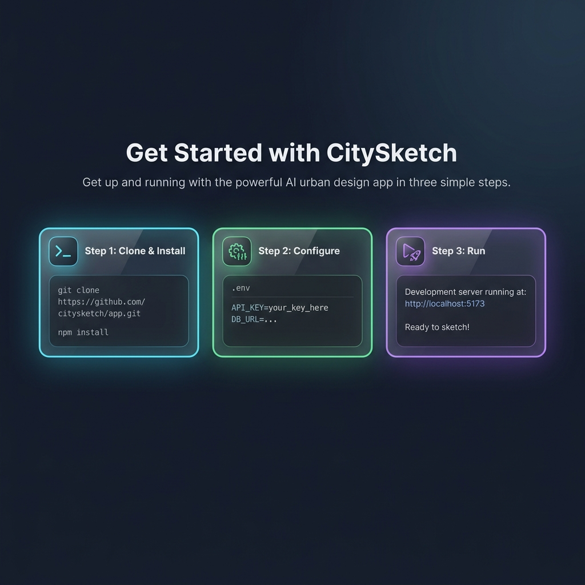

<div align="center">

# 🏙️ CitySketch — AI Urban Design Studio

### Design intelligent cities from plain-English prompts.

CitySketch is an AI-assisted urban planning platform that converts natural-language descriptions into explainable, scorable 2D and 3D city layouts — in seconds, not weeks.

[🚀 Live Demo](https://city-sketch.vercel.app) · [📖 Documentation](#architecture) · [🐛 Report Bug](https://github.com/rahulsp19/citySketch/issues) · [💡 Request Feature](https://github.com/rahulsp19/citySketch/issues)

[](https://react.dev)
[](https://threejs.org)
[](https://nodejs.org)
[](https://vitejs.dev)
[](https://tailwindcss.com)
[](https://opensource.org/licenses/ISC)

<br/>

> _"What if you could describe a city in words — and watch it build itself?"_

<br/>

</div>

---

## 📸 Visual Showcase

<div align="center">



<br/>



<br/>



<br/>



<br/>



</div>

---

## ✨ Core Features

| Feature | Description |
|---------|-------------|
| 🗣️ **Natural Language → City** | Describe your city in plain English — CitySketch parses intent, zones, constraints, and preferences |
| 🧠 **Explainable AI Planning** | Every zone placement and road decision comes with human-readable reasoning |
| 📊 **Walkability & Sustainability Scoring** | Quantified metrics for density, green coverage, traffic pressure, and walkability |
| 🗺️ **Synchronized 2D + 3D Views** | Inspect the same layout from a top-down grid or an interactive Three.js scene |
| ⚖️ **Compare Multiple Layouts** | Generate candidates, rank them side by side, and pick the strongest concept |
| 📦 **PNG / JSON / PDF Export** | One-click export for presentations, reports, and downstream tools |
| 🌍 **Map-Assisted Generation** | Import real geography via Leaflet and generate layouts grounded in actual terrain |
| 🔍 **Per-Cell Explanations** | Click any cell to see why it was placed — zone logic, adjacency reasoning, score contribution |
| 💾 **History & Persistence** | Supabase-backed storage with local JSON fallback for every generation |

---

## 🤔 Why CitySketch?

<table>
<tr>
<td width="50%">

### The Problem

Traditional urban planning tools are powerful — but they're built for late-stage design. They're slow to learn, visually dense, and punishing for early-stage exploration.

When a team needs to explore a district, campus, or smart-city concept, the bottleneck isn't geometry — it's **iteration speed**.

</td>
<td width="50%">

### The CitySketch Approach

CitySketch is built for **rapid concepting**. It reduces the time from idea to inspectable layout so planners, founders, students, and engineers can evaluate options *before* committing to a direction.

Every generated layout is **explainable** — because urban design decisions need to be defensible, not magical.

</td>
</tr>
</table>

**Why explainability matters:** A generated city is only useful if you can understand *why* roads landed where they did, *why* a zone was placed, and *how* the score was computed. CitySketch exposes those decisions directly.

**Why rapid generation matters:** Early design work is about comparison, not perfection. CitySketch makes it easy to generate multiple candidates, score them consistently, and move forward with the strongest concept.

---

## ⚙️ How It Works

```text
┌─────────────────────────────────────────────────────────────┐
│                                                             │
│   "Design a 10-acre eco-friendly city with parks,           │
│    hospitals, low traffic, and commercial zones"            │
│                                                             │
└──────────────────────────┬──────────────────────────────────┘
                           │
                           ▼
                ┌─────────────────────┐
                │   🗣️ Parser Engine   │  LLM-assisted intent
                │   NLP + Structured  │  extraction & normalization
                └──────────┬──────────┘
                           │
                           ▼
                ┌─────────────────────┐
                │  🏗️ Layout Generator │  Procedural zone placement
                │  Heuristic Engine   │  + BFS road connectivity
                └──────────┬──────────┘
                           │
                           ▼
                ┌─────────────────────┐
                │  📊 Scoring Engine  │  Sustainability, traffic,
                │  + Explainability   │  walkability, density metrics
                └──────────┬──────────┘
                           │
                           ▼
                ┌─────────────────────┐
                │  🎨 2D / 3D Render  │  Canvas grid + Three.js
                │  Synchronized Views │  interactive scene
                └──────────┬──────────┘
                           │
                           ▼
                ┌─────────────────────┐
                │  📦 Export + Compare │  PNG / JSON / PDF export
                │  Side-by-Side Rank  │  + layout comparison
                └─────────────────────┘
```

---

## 🏛️ Architecture

CitySketch is split into a **frontend product layer**, a **backend orchestration layer**, and a **generation pipeline** that keeps layout logic, scoring, and explainability cleanly separated.

```text
┌─────────────────────────────────────────────────────────────────────┐
│                        FRONTEND (React + Vite)                      │
│                                                                     │
│  ┌──────────┐  ┌──────────┐  ┌───────────┐  ┌──────────────────┐   │
│  │ Prompt   │  │ 2D Grid  │  │ 3D Scene  │  │ Compare / Score  │   │
│  │ Input    │  │ Canvas   │  │ Three.js  │  │ Dashboard        │   │
│  └────┬─────┘  └────▲─────┘  └─────▲─────┘  └────────▲─────────┘   │
│       │              │              │                  │             │
│       │              └──────────────┴──────────────────┘             │
│       │                        ▲ Zustand Store                      │
└───────┼────────────────────────┼────────────────────────────────────┘
        │  API Request           │  Layout + Scores + Explanations
        ▼                        │
┌───────┴────────────────────────┴────────────────────────────────────┐
│                     BACKEND (Node.js + Express)                     │
│                                                                     │
│  ┌──────────────┐  ┌───────────────┐  ┌─────────────────────────┐  │
│  │ Generate     │  │ History       │  │ Map Context             │  │
│  │ Controller   │  │ Controller    │  │ Controller              │  │
│  └──────┬───────┘  └───────────────┘  └─────────────────────────┘  │
│         │                                                           │
│         ▼                                                           │
│  ┌──────────────┐  ┌───────────────┐  ┌─────────────────────────┐  │
│  │ City         │  │ Scoring       │  │ Explainability          │  │
│  │ Generator    │  │ Engine        │  │ Engine                  │  │
│  └──────────────┘  └───────────────┘  └─────────────────────────┘  │
│                                                                     │
│  ┌──────────────┐  ┌───────────────┐                               │
│  │ LLM Parser   │  │ Supabase /    │                               │
│  │ (Groq/Gemini)│  │ JSON Store    │                               │
│  └──────────────┘  └───────────────┘                               │
└─────────────────────────────────────────────────────────────────────┘
```

### Frontend Responsibilities

- **Prompt input** with a conversation-like workflow and smart prompt suggestions
- **2D canvas rendering** with grid visualization, zone colors, and cell selection
- **3D scene rendering** with Three.js / React Three Fiber for immersive walkthroughs
- **Compare mode** for ranking multiple candidates side by side
- **Score dashboard** with sustainability, traffic, walkability, and density panels
- **Explanation panel** for per-cell and per-zone reasoning
- **Export pipeline** for PNG, JSON, and PDF output
- **State management** via Zustand for workspace, history, and settings

### Backend Responsibilities

- **Prompt parsing** via LLM APIs (Groq, Gemini, OpenAI) with structured normalization
- **Generation orchestration** — routing parsed intent through the city generator
- **Layout persistence** via Supabase with local JSON fallback
- **API surface** — RESTful routes for generate, history, map context, simulate, export, and telemetry
- **Rate limiting** and environment-based configuration for production hardening

### Generator Engine

- Converts parsed requirements into **zone placement** and **road structure** on a grid
- Applies **deterministic heuristics** — adjacency rules, connectivity validation, density constraints
- Uses **BFS road connectivity** to ensure all zones are reachable
- Produces **multiple candidate layouts** for comparison and ranking

### Explainability Engine

- Generates **human-readable reasoning** for every cell and zone decision
- Surfaces **why a layout was scored** the way it was
- Keeps planning logic **reviewable and auditable** — not a black box

### Scoring Engine

- Computes **sustainability** (park coverage), **traffic pressure** (road density + connectivity), **walkability** (residential ↔ amenity distance), and **density** (residential efficiency)
- Maintains **scoring consistency** across regenerated layouts
- Powers **compare mode** and candidate ranking

### Rendering Pipeline

- A single layout model feeds **both 2D and 3D views** from one source of truth
- The same city data powers canvas rendering, Three.js rendering, and export pipelines
- UI stays **synchronized** so users can inspect a concept from any angle

---

## 📊 Scoring Logic

CitySketch uses **simple, explainable scoring** rather than opaque simulation claims. The goal is to produce meaningful comparison signals, not a full urban physics engine.

```text
Sustainability  =  park_cells / total_cells
Traffic         =  f(road_coverage, road_density, connectivity)
Walkability     =  inverse(avg_distance(residential → key_amenities))
Density         =  residential_cells / buildable_cells
```

These formulas are intentionally lightweight. They make results **intuitive to inspect** and support **side-by-side comparison** across multiple generated layouts.

---

## 🧪 Engineering Highlights

These are the technical details that make CitySketch more than a prototype:

| Area | Detail |
|------|--------|
| **BFS Road Connectivity** | Graph traversal validates and strengthens road networks — every zone must be reachable |
| **Synchronized 2D/3D Rendering** | Single layout store powers both Canvas grid and Three.js scene in real time |
| **Explainability Engine** | Zone-level reasoning generated for every placement decision — not post-hoc, but inline |
| **Procedural Generation** | Deterministic heuristics produce consistent, reproducible layouts from the same input |
| **Compare Mode** | Generate N candidates, score them uniformly, rank them, and export the winner |
| **Hybrid AI Architecture** | LLM handles messy natural language; heuristic engine handles structured city design |
| **Blueprint View** | Architectural blueprint-style rendering mode (~30KB of specialized visualization logic) |
| **Map Grounding** | Leaflet integration for importing real-world geography into generation context |

---

## 🔬 AI + Heuristics Transparency

CitySketch combines three layers — **by design**:

| Layer | Role | Why |
|-------|------|-----|
| **LLM-Assisted Parsing** | Interprets messy natural-language prompts into structured requirements | Humans don't write specs — they write wishes. LLMs bridge that gap. |
| **Deterministic Heuristics** | Applies predictable urban planning rules for zone placement, road routing, adjacency | Layouts need to be reproducible and consistent, not stochastic. |
| **Explainability-First Logic** | Every output can be reviewed, questioned, and defended | Trust requires transparency. No black-box generation. |

> **Honesty note:** This is not a claim that the model autonomously understands urban design. CitySketch is a practical hybrid system — the AI helps interpret intent, and the planning engine does the structured work. We don't oversell what the system does.

---

## 🛠️ Tech Stack

<table>
<tr>
<td valign="top" width="33%">

### Frontend
| Tech | Purpose |
|------|---------|
| React 19 | UI framework |
| Vite 8 | Build tooling |
| TailwindCSS 4 | Utility-first styling |
| Zustand | State management |
| Three.js | 3D rendering |
| React Three Fiber | React ↔ Three.js bridge |
| Framer Motion | Animations |
| GSAP | Advanced animations |
| Leaflet | Map integration |
| Radix UI | Accessible primitives |
| Rough.js | Hand-drawn style rendering |

</td>
<td valign="top" width="33%">

### Backend
| Tech | Purpose |
|------|---------|
| Node.js | Runtime |
| Express 5 | API framework |
| Supabase | Persistence layer |
| Rate Limiter | API protection |
| Google Auth | Authentication |

</td>
<td valign="top" width="33%">

### AI / Algorithms
| Tech | Purpose |
|------|---------|
| Groq API | Fast LLM inference |
| Gemini API | Google AI models |
| OpenAI API | GPT models |
| BFS Connectivity | Road network validation |
| Procedural Gen | Deterministic layout logic |
| Explainability | Inline reasoning engine |
| Scoring Heuristics | Quantified city metrics |

</td>
</tr>
</table>

---

## 🎬 Demo Flow

Use this flow for a clean product demo or investor walkthrough:

```text
Step 1  │  Enter a prompt:
        │  "Design a 10-acre eco-friendly city with parks, hospitals,
        │   low traffic, and commercial zones"
        │
Step 2  │  Click Generate → watch the layout build
        │
Step 3  │  Inspect the 2D grid view — zones, roads, green spaces
        │
Step 4  │  Switch to 3D view — walk through the city in Three.js
        │
Step 5  │  Open the Score Dashboard — sustainability, walkability, density
        │
Step 6  │  Click a zone → read the per-cell explanation
        │
Step 7  │  (Optional) Import a map area → regenerate with real geography
        │
Step 8  │  Compare multiple generated layouts side by side
        │
Step 9  │  Export the best candidate as PNG / JSON / PDF
```

**Try these prompts:**

> _"Create a 15-acre mixed-use smart district with commercial zones, parks, schools, and low-traffic residential pockets"_

> _"Plan a compact city near a lake with walkable housing, healthcare, and strong green coverage"_

---

## 🚀 Getting Started

### Prerequisites

- **Node.js** 18+ and **npm**
- **Git**
- API key for at least one LLM provider (Groq, Gemini, or OpenAI)
- _(Optional)_ Supabase project for persistent history storage
- _(Optional)_ Google API credentials for auth and map features

### Installation

```bash
# Clone the repository
git clone https://github.com/rahulsp19/citySketch.git
cd citySketch

# Install backend dependencies
cd backend_ai
npm install

# Install frontend dependencies (new terminal)
cd ../frontend_ai
npm install
```

### Environment Setup

```bash
# Copy the environment template
cp .env.example .env
```

Configure your `.env` with the required values:

```env
# ── Server ────────────────────────────────────────
PORT=3001

# ── Database (optional — falls back to local JSON) ─
SUPABASE_URL=https://your-project.supabase.co
SUPABASE_ANON_KEY=your_supabase_anon_key

# ── AI Providers (at least one required) ──────────
OPENROUTER_API_KEY=
GEMINI_API_KEY=
GROQ_API_KEY=

# ── Google Auth (optional) ────────────────────────
GOOGLE_CLIENT_ID=
GOOGLE_CLIENT_SECRET=
GOOGLE_API_KEY=
VITE_GOOGLE_CLIENT_ID=
VITE_GOOGLE_API_KEY=

# ── Frontend API Routing ─────────────────────────
VITE_API_BASE_URL=
VITE_DEV_API_TARGET=http://localhost:3001
```

### Run Development Servers

```bash
# Terminal 1 — Backend (Express on port 3001)
cd backend_ai
npm run dev

# Terminal 2 — Frontend (Vite on port 5173)
cd frontend_ai
npm run dev
```

| Service | URL |
|---------|-----|
| Frontend | http://localhost:5173 |
| Backend | http://localhost:3001 |

### Build & Preview

```bash
cd frontend_ai
npm run build
npm run preview
```

### Run Tests

```bash
cd backend_ai
npm test
```

---

## ☁️ Deployment

### Frontend → Vercel

1. Connect your GitHub repo to [Vercel](https://vercel.com)
2. Set the root directory to `frontend_ai`
3. Configure environment variables:

| Variable | Value |
|----------|-------|
| `VITE_API_BASE_URL` | Your Render backend URL (e.g. `https://citysketch-api.onrender.com`) |
| `VITE_GOOGLE_CLIENT_ID` | Google OAuth client ID _(if auth enabled)_ |
| `VITE_GOOGLE_API_KEY` | Google API key _(if map features enabled)_ |

> See [`frontend_ai/.env.vercel.example`](frontend_ai/.env.vercel.example) for the full template.

### Backend → Render

1. Create a new **Web Service** on [Render](https://render.com)
2. Set the root directory to `backend_ai`
3. Set the start command to `npm start`
4. Configure environment variables:

| Variable | Value |
|----------|-------|
| `SUPABASE_URL` | Your Supabase project URL |
| `SUPABASE_ANON_KEY` | Your Supabase anon key |
| `LLM_PROVIDER` | `groq`, `gemini`, or `openai` |
| `GROQ_API_KEY` / `GEMINI_API_KEY` | Matching API key |
| `CORS_ALLOWLIST` | Your Vercel domain + preview URLs |

> `PORT` is injected automatically by Render — do not hardcode it.
>
> See [`backend_ai/.env.render.example`](backend_ai/.env.render.example) for the full template.

### Production Checklist

- [ ] Backend CORS allowlist includes all frontend domains
- [ ] Frontend `VITE_API_BASE_URL` points to production backend
- [ ] At least one LLM provider key is configured
- [ ] Generation, export, and history persistence tested end-to-end
- [ ] Rate limiting configured for production traffic

---

## 📁 Project Structure

```text
citySketch/
├── backend_ai/                    # API server, generation engine, scoring
│   ├── src/
│   │   ├── controllers/           # Route handlers
│   │   │   ├── generateController.js    # Core generation orchestration
│   │   │   ├── historyController.js     # Layout history CRUD
│   │   │   ├── mapContextController.js  # Map-based generation
│   │   │   └── simulateController.js    # Simulation endpoints
│   │   ├── services/
│   │   │   ├── generator/
│   │   │   │   └── CityGenerator.js     # 🔑 Core procedural engine (~38KB)
│   │   │   ├── scoringEngine.js         # Sustainability/traffic/walkability
│   │   │   ├── explainer.js             # Per-cell reasoning engine
│   │   │   ├── analyzer.js              # Layout analysis utilities
│   │   │   └── suggester.js             # Prompt suggestion engine
│   │   ├── routes/                # RESTful API routing
│   │   ├── middlewares/           # Rate limiting, auth, CORS
│   │   └── config/               # Environment configuration
│   ├── data/                      # Sample data & generated history
│   ├── tests/                     # Scoring parity tests
│   └── server.js                  # Express entry point
│
├── frontend_ai/                   # React + Vite app
│   ├── src/
│   │   ├── app/                   # App shell, routing, providers
│   │   ├── pages/                 # Page-level components
│   │   ├── widgets/               # Core workspace components
│   │   │   ├── Canvas.tsx               # 2D layout entry point
│   │   │   ├── Grid2D.tsx               # 2D grid rendering
│   │   │   ├── Scene3D.tsx              # 🔑 Three.js 3D scene (~25KB)
│   │   │   ├── BlueprintView.tsx        # Blueprint-style view (~31KB)
│   │   │   ├── CompareView.tsx          # Side-by-side comparison
│   │   │   ├── ScoreDashboard.tsx       # Metrics visualization
│   │   │   ├── ExplanationPanel.tsx     # Per-cell explanations
│   │   │   ├── InsightsPanel.tsx        # AI insights & analysis
│   │   │   └── WorkspaceHeader.tsx      # Workspace controls
│   │   ├── features/              # Feature modules
│   │   ├── entities/              # Domain models & stores
│   │   └── shared/                # Shared utilities & components
│   ├── landing_ui/                # Landing page assets
│   ├── public/                    # Static assets (favicon, icons)
│   └── index.html                 # Entry HTML
│
├── utils/                         # Shared parsing / layout helpers
├── docs/
│   └── images/                    # README screenshots & assets
├── .env.example                   # Environment template
└── README.md
```

**Key entry points for contributors:**

| What | File |
|------|------|
| Generation orchestrator | [`generateController.js`](backend_ai/src/controllers/generateController.js) |
| Core city engine | [`CityGenerator.js`](backend_ai/src/services/generator/CityGenerator.js) |
| Explainability logic | [`explainer.js`](backend_ai/src/services/explainer.js) |
| Scoring calculations | [`scoringEngine.js`](backend_ai/src/services/scoringEngine.js) |
| 2D canvas rendering | [`Canvas.tsx`](frontend_ai/src/widgets/Canvas.tsx) |
| 3D scene rendering | [`Scene3D.tsx`](frontend_ai/src/widgets/Scene3D.tsx) |
| Layout comparison | [`CompareView.tsx`](frontend_ai/src/widgets/CompareView.tsx) |
| Blueprint mode | [`BlueprintView.tsx`](frontend_ai/src/widgets/BlueprintView.tsx) |

---

## 🗺️ Roadmap

### 🟢 Short Term
- [ ] Improved prompt parsing with better intent extraction
- [ ] More zone types (industrial, transit, mixed-use)
- [ ] Smoother 3D navigation and camera controls
- [ ] Better map import UX with region selection

### 🟡 Mid Term
- [ ] **Editable layouts** — drag-and-drop zones after generation
- [ ] **Blueprint mode** polish and export
- [ ] **Comparative layout scoring** with weighted criteria
- [ ] **Collaborative editing** — multiple users, same workspace

### 🔴 Long Term
- [ ] **GIS integration** — import real zoning and land-use data
- [ ] **Real zoning constraints** — regulatory compliance checks
- [ ] **Infrastructure optimization** — utility routing, traffic flow simulation
- [ ] **Multi-objective planning** — Pareto-optimal layout generation
- [ ] **Domain-specific planners** — campuses, districts, smart villages, disaster relief

---

## 🧭 Design Principles

> These principles guide every decision in CitySketch — from architecture to pixel.

1. **Keep generation logic simple and explainable.** If a human can't understand why a zone was placed, the system has failed.
2. **Prefer a working demo over perfect realism.** A credible prototype beats an incomplete simulation every time.
3. **Make every screen understandable in seconds.** No training needed — the UI should communicate intent immediately.
4. **Every generated layout must justify itself.** Explanations are not optional — they are core product.
5. **Use constraints to feel intelligent, not random.** Good heuristics make output feel designed, not generated.

---

## 🏗️ Build Priorities

If you need to ship a strong demo quickly, build in this order:

| Priority | Feature | Why |
|----------|---------|-----|
| 1 | Prompt input | The entry point — everything flows from here |
| 2 | Parser → JSON | Structured intent is the foundation of generation |
| 3 | 2D layout engine | The first visible output — make it credible |
| 4 | Score panel | Quantified quality makes it feel real |
| 5 | Explainability panel | Transparency differentiates from toy projects |
| 6 | 3D visualization | The "wow" moment for demos and pitches |
| 7 | Map-based simulation | Geographic grounding for advanced use cases |

---

## 🤝 Contributing

Contributions are welcome! CitySketch is a real product with real users — quality matters.

### High-Impact Contribution Areas

| Area | Examples |
|------|---------|
| **Layout Heuristics** | Zone adjacency rules, road routing algorithms, density optimization |
| **Scoring Models** | New metrics, weighted scoring, user-defined criteria |
| **Geospatial** | GIS data import, coordinate mapping, terrain-aware generation |
| **UI / UX** | Interaction polish, responsive design, accessibility improvements |
| **3D Rendering** | Camera controls, lighting, building models, performance optimization |
| **Map Simulation** | Leaflet integration, real-world geography, terrain adaptation |

### Issue Workflow

1. Open an issue with a clear problem description, expected behavior, and reproduction steps
2. Attach screenshots or sample prompts when relevant
3. Tag the related system area (`generator`, `scoring`, `frontend`, `3d`, `map`)

### Pull Request Workflow

1. Target the `main` branch
2. Keep changes focused — one feature or fix per PR
3. Include a test plan or manual verification notes
4. Call out any AI, scoring, or UX tradeoffs explicitly
5. Ensure the generation pipeline still produces valid layouts

---

## 👥 Team

| Maintainer | GitHub |
|-----------|--------|
| **Rahul S** | [@rahulsp19](https://github.com/rahulsp19) |
| **Pranav** | [@pranav-pachn](https://github.com/pranav-pachn) |
| **Siddarth** | [@lalithsiddartha69](https://github.com/lalithsiddartha69) |

### Team Roles

| Role | Focus |
|------|-------|
| Member 1 | Prompt parsing, AI integration, input normalization |
| Member 2 | Core layout engine, zone placement algorithms |
| Member 3 | 2D + 3D rendering, visualization pipeline |
| Member 4 | UI, scoring, explainability, product pitch |

For questions, [open an issue](https://github.com/rahulsp19/citySketch/issues) or tag a maintainer in a PR.

---

## 📄 License

CitySketch is licensed under the **ISC License**. See the [LICENSE](LICENSE) file for details.

---

<div align="center">

**Built with ❤️ for urban planners, engineers, and dreamers.**

[🚀 Try the Live Demo](https://city-sketch.vercel.app) · [⭐ Star on GitHub](https://github.com/rahulsp19/citySketch) · [🐛 Report a Bug](https://github.com/rahulsp19/citySketch/issues)

</div>